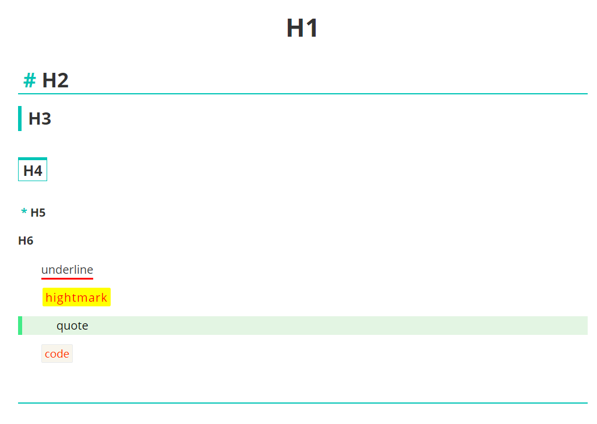

# Typora-gjun-theme
- a green-style Typora theme,which is based on github-theme. 
- [中文](README_CN.md)

## Introduction
[Typora](https://www.typora.io/) is a markdown editor and reader that supports real-time preview. It supports Windows, macOS, Linux platforms. Typora is a qualified Markdown editor that supports images, lists, tables, codes, formulas, catalogs, etc. At the same time, typora also supports (one-click) dynamic preview function, so that everything becomes so clean and pure. And there are various theme templates.

## Install
1. Download this theme from Github, then you can get the `gjun.css`.
2. Open typora. Click "Open Theme Folder" button from `Preference Panel` → `Apperance` section.
3. Put `gjun.css` folder into the opened folder, make sure your css files are directly under that directory.
4. Close and reopen Typora and select `Theme` → `gjun.css` from the menu bar.

## Screenshots

