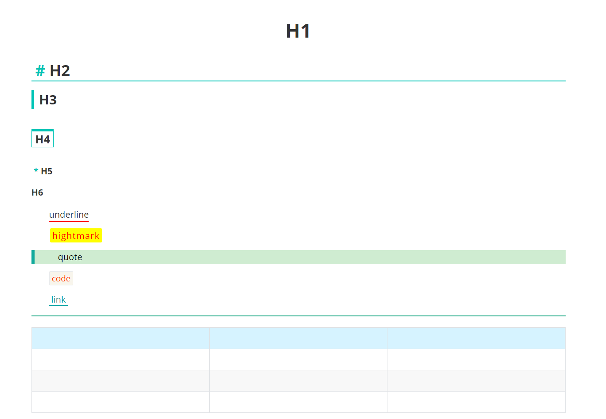

## 介绍
[Typora](https://www.typora.io/)是一款支持实时预览的 Markdown 编辑器和阅读器，支持`Windows`、`macOS`、`Linux`三大平台。Typora 作为一款合格的 Markdown 编辑器，支持图片、列表、表格、代码、公式、目录等功能，同时这款软件还支持（一键）动态预览功能，让一切都变得如此干净、纯粹。并且有多种主题模板。

## 安装主题
1. 下载本主题中的`gjun.css`文件；
2. 打开 Typora，点击`偏好设置` => `打开主题文件夹`按钮，将弹出 Typora 的主题文件夹；
3. 将下载好的`gjun.css`文件放到 Typora 的主题文件夹中；
4. 关闭并重新打开 Typora，从菜单栏中选择 “主题” => `gjun.css` 即可。

## 预览

## 更新记录
### 2022.7.17
- 修改了**各级标题**、**引用**、**下划线**的样式。

### 2022.8.9
1. 给**二级标题**前面加了`#`。
3. 调整了**引用块**的颜色。
4. 修改了**代码块**、**高亮**、**分割线**。

### 2022.8.19
1. 修改了**超链接**的样式。
2. 修改了**表头**的背景色。
